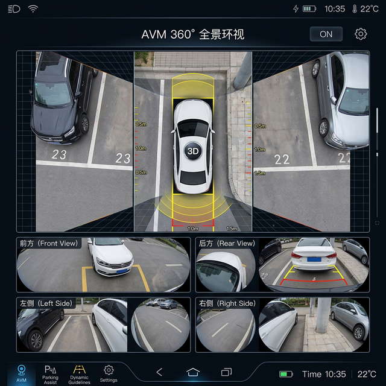

# AVM-SurroundView — 360° 全景环视拼接系统

[](https://python.org/)
[](https://opencv.org/)
[](https://numpy.org/)
[](LICENSE)

## 项目背景

汽车全景环视系统（AVM, Around View Monitor）是现代车辆的重要辅助驾驶功能。通过车身四周安装的鱼眼摄像头（前、后、左、右），将四路画面拼接成一幅俯视视角的全景图像，让驾驶员直观看到车辆周围 360° 的环境，解决低速行驶和泊车时的视野盲区问题。

然而鱼眼镜头存在严重的畸变，四路画面的拼接需要精确的标定、去畸变和融合处理。本项目实现了一套完整的 AVM 图像处理流水线：从鱼眼镜头标定、畸变校正、透视变换到多路图像无缝拼接。

## 效果展示



四路鱼眼摄像头画面经过去畸变和透视变换后，无缝拼接为车辆周围的俯视全景图。

## 核心功能

| 功能 | 说明 |
|------|------|
| 鱼眼标定 | 棋盘格标定法获取相机内外参数 |
| 畸变校正 | 鱼眼镜头径向/切向畸变去除 |
| 透视变换 | 将各摄像头视角统一映射到俯视平面 |
| 图像拼接 | 四路画面无缝融合，过渡区域平滑处理 |
| 实时处理 | 优化算法支持视频流实时拼接 |

## 技术栈

| 组件 | 技术 |
|------|------|
| 图像处理 | OpenCV 4.x |
| 数学计算 | NumPy、SciPy |
| 标定工具 | OpenCV Camera Calibration |
| 可视化 | Matplotlib |
| 语言 | Python 3.8+ |

## 处理流程

```
鱼眼图像采集 → 相机标定 → 畸变校正 → 透视变换 → 图像拼接 → 全景输出
     ↓              ↓           ↓           ↓          ↓
  4路摄像头     内外参矩阵    去除桶形畸变   俯视映射    融合过渡区
```

## 项目结构

```
AVM-SurroundView/
├── calibration/                # 标定模块
│   ├── calibrate.py            # 相机标定
│   └── params/                 # 标定参数
├── undistort/                  # 去畸变模块
├── perspective/                # 透视变换
├── stitching/                  # 图像拼接
│   ├── stitch.py               # 拼接主逻辑
│   └── blend.py                # 融合算法
├── utils/                      # 工具函数
├── images/                     # 测试图像
├── main.py                     # 主入口
├── requirements.txt
└── README.md
```

## 快速开始

```bash
# 安装依赖
pip install opencv-python numpy scipy matplotlib

# 相机标定（需要棋盘格标定图）
python calibration/calibrate.py --images calibration/images/ --output calibration/params/

# 运行全景拼接
python main.py --input images/ --output output/surround_view.png

# 实时视频拼接
python main.py --video --cameras 0 1 2 3
```

## 开源协议

MIT License
