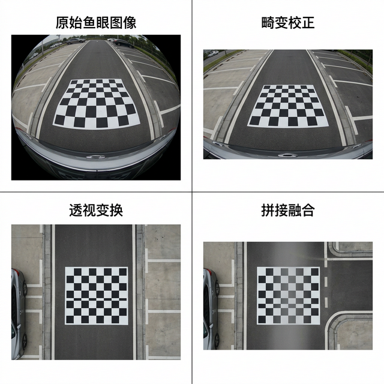
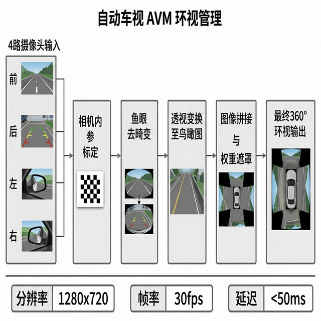

# AVM 360° 全景环视系统

> 基于多摄像头图像拼接的车载全景环视（Around View Monitor）实现方案

## 项目目的

倒车和低速场景下，驾驶员需要全方位了解车辆周围环境。本项目基于 4 路鱼眼摄像头，通过相机标定、畸变校正、透视变换和图像拼接，实时生成车辆的 360° 俯视全景图像，辅助驾驶员安全泊车和低速行驶。

## 解决的痛点

- 单路倒车影像视角有限，存在盲区
- 商用 AVM 方案成本高且不开源
- 鱼眼畸变校正和多路图像无缝拼接的工程实现复杂
- 拼接缝处的色差和过渡不自然

## 效果展示

### 标定与校正流程

从原始鱼眼图像到畸变校正、透视变换的完整标定流程。



### 处理管线架构

4 路摄像头输入到全景拼接输出的完整数据处理流水线。



### 360° 全景拼接效果

四路摄像头图像无缝拼接为车辆周围俯视图。


## 技术方案

| 步骤 | 实现方法 |
|------|---------|
| 相机标定 | 棋盘格标定法，提取内参和畸变系数 |
| 畸变校正 | OpenCV fisheye 模型去畸变 |
| 透视变换 | 单应性矩阵计算 BEV 视角 |
| 图像拼接 | 加权融合 + 拉普拉斯金字塔混合 |
| 亮度均衡 | 直方图均衡化消除色差 |
| 实时渲染 | OpenGL 纹理映射加速 |

## 系统参数

| 参数 | 数值 |
|------|------|
| 输入分辨率 | 1280 × 720 × 4 路 |
| 输出分辨率 | 1080 × 1080 |
| 处理帧率 | ≥ 30 FPS |
| 端到端延迟 | < 50ms |
| 视野覆盖 | 360° 无盲区 |

## 快速开始

```bash
git clone https://github.com/xiaofuqing13/AVM-SurroundView.git
cd AVM-SurroundView

pip install -r requirements.txt

# 运行标定
python calibrate.py --input calibration_images/

# 运行拼接
python surround_view.py --config config.yaml
```

## 项目结构

```
AVM-SurroundView/
├── calibrate.py        # 相机标定
├── undistort.py        # 畸变校正
├── perspective.py      # 透视变换
├── stitcher.py         # 图像拼接
├── surround_view.py    # 主程序
├── config/             # 配置文件
└── docs/               # 文档截图
```

## 开源协议

MIT License
